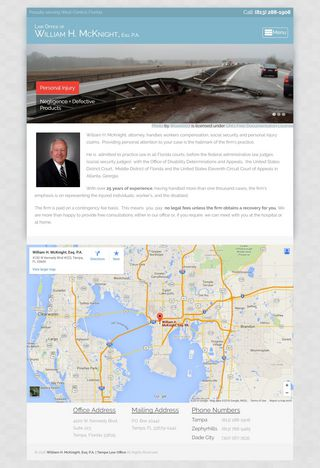

A snapshot of the original site is viewable using [WaybackMachine](https://web.archive.org/web/20120213173617/http://williamhmcknight.com/). This  project switched the Wordpress site to the [Gather](https://themetrust.com/themes/gather/) theme, and added customizations.

See a snapshot of the full homepage:

<picture>
	<source media="(min-width: 640px)" srcset="images/lawoffice-full-medium_1x.jpg 1x, images/lawoffice-full-medium_2x.jpg 2x">
	<source media="(min-width: 320px)" srcset="images/lawoffice-full-small_1x.jpg 1x, images/lawoffice-full-small_2x.jpg 2x">
	
</picture>

Adding an off-canvas menu helps potential clients who are browsing on mobile phones. The additional map helps users locate the office and obtain directions. Improvements to the appearance include Creative Commons images, a subtle background, and typographical changes.
