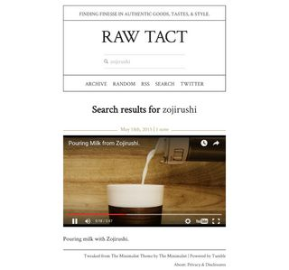

Using [IFTTT](ifttt.com) to connect Tumblr and Reddit, this project allows me to blog with the click of an upvote. Links to the posts are provided so readers can join the conversation on Reddit. The user who posted the link is cited.

Keeping within the restrains of the backend, this theme adds improvements for high pixed density displays to the the [The Minimalist Theme](http://minimalist.co/).

<picture>
	<source media="(min-width: 640px)" srcset="images/raw-tact-search-medium_1x.jpg 1x, images/raw-tact-search-medium_2x.jpg 2x">
	<source media="(min-width: 320px)" srcset="images/raw-tact-search-small_1x.jpg 1x, images/raw-tact-search-small_2x.jpg 2x">
	
</picture>
