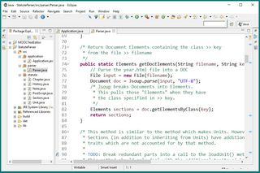
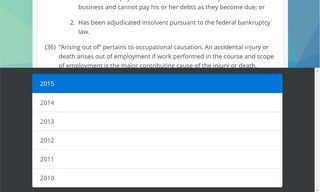

The front-end starts with back-end (of sorts) in Java. This application uses Jsoup to parse DOM elements from HTML which I have downloaded. It breaks the content of the statute into objects ranging from the smallest units (I call them 'Unit' but they appear as 'paragraphs' through 'sub-sub-sub-sub-paragraphs' in the law), to Sections, to Chapters. Paragraphs have numbers and text.
<picture>
	<source media="(min-width: 640px)" srcset="images/views-java-medium_1x.jpg 1x, images/views-java-medium_2x.jpg 2x">
	<source media="(min-width: 320px)" srcset="images/views-java-small_1x.jpg 1x, images/views-java-small_2x.jpg 2x">
	
</picture>

Sections contain paragraphs, but may also contain an Introduction, Reversion, Catchline, History, and multiple Notes. Sections also mantain a list of years it exists, since they are added and removed occasionally.

Each section object is output to an HTML file with front-matter for use by Jekyll. The Java application also uses regex to identify History citations to the Florida Laws, and embed links to those amendments.
<picture>
	<source media="(min-width: 640px)" srcset="images/views-features-medium_1x.jpg 1x, images/views-features-medium_2x.jpg 2x">
	<source media="(min-width: 320px)" srcset="images/views-features-small_1x.jpg 1x, images/views-features-small_2x.jpg 2x">
	
</picture>
Javascript features include the addition of a search box, which is prefilled with user-highlighted text. This text is also set to query Google Scholar to search caselaw or the statute (by way of a public search engine).

While the Florida Legislature's website requires users to return to the main page to change years, this site provides a drawer containing the available years for easy navigation.
<picture>
	<source media="(min-width: 640px)" srcset="images/views-years-medium_1x.jpg 1x, images/views-years-medium_2x.jpg 2x">
	<source media="(min-width: 320px)" srcset="images/views-years-small_1x.jpg 1x, images/views-years-small_2x.jpg 2x">
	
</picture>
